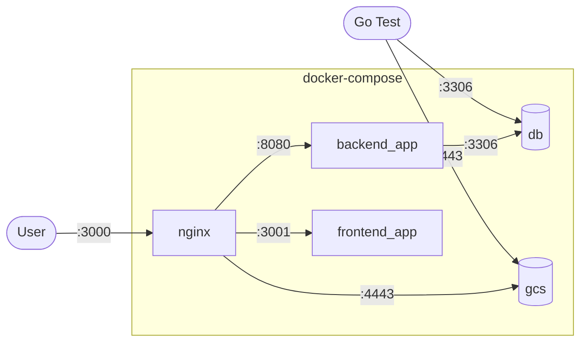
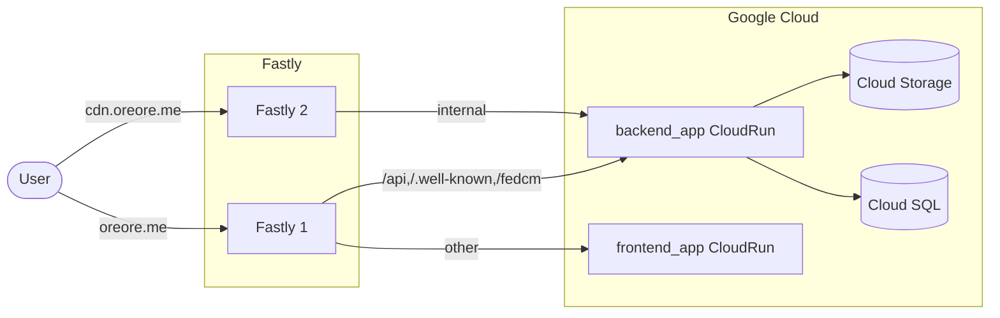

<h1 align="center">Oreore.me</h1>

IdP

## Quick Start

このリポジトリでは、`docker`があれば1コマンドで開発環境を構築できます。

```bash
docker compose up

# http://localhost:3000
```

`docker compose`では、以下の4つのコンテナが立ち上がります。

|name|種類|ポート|
|:--|:--|:--:|
|`backend_app`|Goのバックエンドサーバー|`8080`|
|`frontend_app`|Next.jsサーバー|`3001`|
|`nginx`|APIとNext.jsを同じポートで配信するためのプロキシ|`3000`|
|`db`|MySQLサーバー|`3306`|
|`gcs`|オブジェクトストレージサーバー|`4443`|
|`gcs(via nginx)`|オブジェクトストレージサーバー|`3002`|

### ローカル環境構成図



### 本番環境構成図



### 管理画面に入る方法

> [!WARNING]
> この機能はローカル環境のみ有効です。他の環境では`staff`テーブルにINSERTしてください。

ローカル環境では、`admin@local.test`というメールアドレスをもつユーザーが作成されています。[パスワード再設定](http://localhost:3000/forget_password)からパスワードを再設定してください。

再設定用のURLはDEBUGログに以下のように出力されます。

```log
2023-09-03T13:34:11.747+0900       DEBUG   src/handler.go:160      send mail       {"email_address": "admin@local.test", "subject": "パスワードを再設定してください", "data": {"URL":"http://localhost:3000/forget_password/reregister?email=admin%40local.test&token=8K7R0stblqJLp8AyIOh3yzFYYSQl3RA","UserName":"admin","Expiration":"2023-09-03T13:39:11.747804793+09:00","BrandName":"oreore.me local","BrandUrl":"http://localhost:3000","BrandImageUrl":"https://todo","BrandDomain":"localhost:3000","Email":"admin@local.test"}}
```

## Storybook, Test and Lint

```bash
# DBは起動しておく
./script/docker-compose-db.sh up -d

# Go test
go mod download
./script/test

# ----

# Next.js lint
pnpm i
pnpm lint

# ----

# Storybook
pnpm storybook
# http://localhost:6006
```

## データベースのマイグレーション

このリポジトリでは、`mysqldef`を使用して簡単にマイグレーションを実行しています。

1. `db/schema.sql`を編集します。
2. `docker compose up -d`でDBを起動します。
3. `./scripts/setup_migrate.sh [マイグレーション名]`を実行します。
4. `db/migrations/`に`up`と`down`のDDLが作成されるので内容が問題ないか確認します。
5. `./scripts/migrate.sh up`を実行してデータベースにマイグレーションを実行します。
6. `./scripts/sqlboiler.sh`を実行してSQLBoilerのモデルを出力します。

## Environments

- Goは[./src/config.go](./src/config.go)に`os.Getenv`があります。
- Next.jsは[./utils/config.ts](./utils/config.ts)に`process.env`があります。

```env
# APIのホスト
# Next.js側でAPIに接続する際に使用
# 未指定時はデフォルトで相対パスになります
NEXT_PUBLIC_API_HOST=[API host]

# reCAPTCHAのトークン
NEXT_PUBLIC_RE_CAPTCHA=[token]

# GAのトークン
NEXT_PUBLIC_GOOGLE_ANALYTICS_ID=[token]

# ステージング環境などの場合に設定します
NEXT_PUBLIC_PUBLICATION_TYPE=[publication type]

# コミットハッシュ
# Cloud Buildで自動的に埋めています
NEXT_PUBLIC_REVISION=[hash]

# ブランチ名
# Cloud Buildで自動的に埋めています
NEXT_PUBLIC_BRANCH_NAME=[branch name]

# reCAPTCHAのシークレット
# ローカル、テストではreCAPTCHAは使用しないので空でOK
RECAPTCHA_SECRET=[secret]

# mailgunのシークレット
# ローカル、テストではメールを送信しないので空でOK
MAILGUN_SECRET=[secert]

# fastryのトークン
# ローカル、テストではfastlyは使っていないので空でOK
FASTLY_API_TOKEN=[token]
```

## MySQLに入る

```bash
./scripts/sql.sh
```

## oreore.me 変更状況

- [x] ドメイン
- [x] CORS
- [x] Email
- [x] WebAuthn
- [x] タイトル
- [x] ストレージ
- [x] OTPのIssuer
- [ ] ブランチ名
- [x] ローカルデータベース
- [x] 本番データベース
- [ ] Goのパッケージ名
- [ ] Storybook
- [x] README
