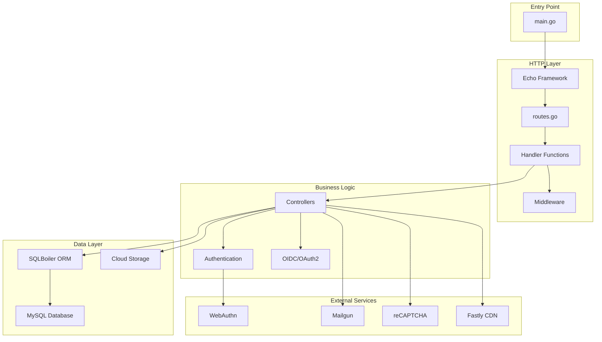
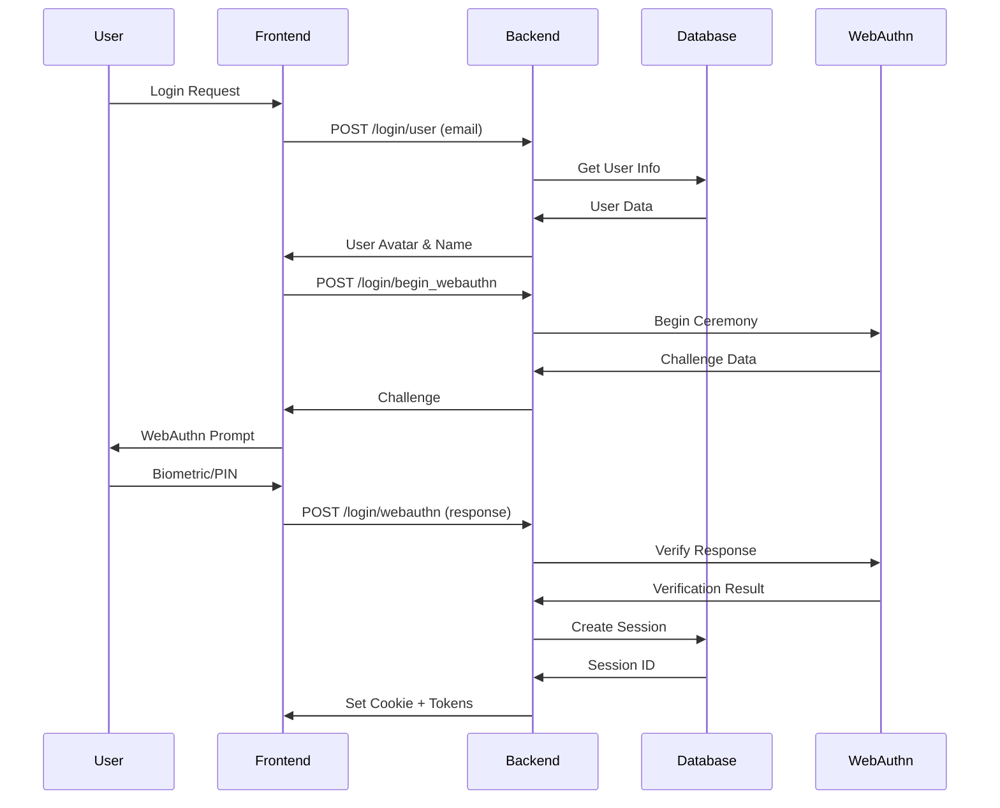

# バックエンドアーキテクチャ

Oreore.meのバックエンドは、Go言語でWebAuthnベースのSSO Identity Providerとして設計されています。

## 🏗️ アーキテクチャ概要



## 📁 ディレクトリ構造

```
src/
├── main.go                     # エントリーポイント
├── config.go                   # 設定管理（環境別）
├── routes.go                   # ルート定義
├── handler.go                  # HTTPハンドラー基底
├── middleware.go               # カスタムミドルウェア
│
├── *_handler.go                # 機能別ハンドラー
│   ├── account_handler.go      # アカウント管理
│   ├── login_handler.go        # ログイン機能
│   ├── register_handler.go     # 登録機能
│   ├── admin_handler.go        # 管理者機能
│   ├── client_handler.go       # OIDCクライアント管理
│   └── oidc_handler.go         # OIDC/OAuth2実装
│
├── *_controller.go             # ビジネスロジック
│   ├── session_controller.go   # セッション管理
│   ├── db_controller.go        # データベース操作
│   ├── email_controller.go     # メール送信
│   └── token_endpoint_controller.go  # トークンエンドポイント
│
├── lib/                        # 共通ライブラリ
│   ├── password/              # パスワードハッシュ
│   ├── jwt/                   # JWT処理
│   └── sender/                # メール送信
│
└── __snapshots__/             # テストスナップショット
    └── *.snap
```

## 🔧 主要コンポーネント

### 1. Echo Framework + ルーティング

**ファイル**: [`routes.go`](../../src/routes.go)

```go
func Routes(e *echo.Echo, h *Handler, c *Config) {
    e.GET("/", h.Root)

    common := e.Group("/api/v2")

    // CSRF対策（本番環境のみ）
    if c.EnableCSRFMeasures {
        common.Use(CSRFMiddleware)
    }

    // API グループ定義
    register := common.Group("/register")  // アカウント登録
    login := common.Group("/login")        // ログイン
    account := common.Group("/account")    // アカウント管理
    oidc := common.Group("/oidc")         // OIDC実装
}
```

**特徴**:
- REST API設計
- 機能別グループ化
- ミドルウェアによる横断的関心事の分離

### 2. ハンドラーレイヤー

各ハンドラーファイルは特定の機能領域を担当：

| ファイル | 責務 |
|----------|------|
| `account_handler.go` | アカウント操作（一覧・切り替え・削除・OTP） |
| `login_handler.go` | ログイン（WebAuthn・パスワード・OTP） |
| `register_account_handler.go` | アカウント登録フロー |
| `oidc_handler.go` | OpenID Connect実装 |
| `admin_handler.go` | 管理者機能 |
| `client_handler.go` | OIDCクライアント管理 |

### 3. コントローラーレイヤー

ビジネスロジックを分離：

```go
// session_controller.go - セッション管理
func CreateSession(ctx context.Context, db *sql.DB, userID string) (*SessionInfo, error)
func ValidateSession(ctx context.Context, db *sql.DB, sessionToken string) (*UserInfo, error)

// db_controller.go - データベース操作
func ConnectDB(config *mysql.Config) (*sql.DB, error)
func BeginTransaction(ctx context.Context, db *sql.DB) (*sql.Tx, error)

// email_controller.go - メール送信
func SendVerificationEmail(ctx context.Context, email string, code string) error
func SendPasswordResetEmail(ctx context.Context, email string, token string) error
```

### 4. 認証システム

#### WebAuthn実装

```go
// WebAuthnの設定
WebAuthnConfig: &webauthn.Config{
    RPDisplayName: "oreore.me",
    RPID:          "oreore.me",
    RPOrigins:     []string{"https://oreore.me"},
    Timeouts: webauthn.TimeoutsConfig{
        Login:        webauthn.TimeoutConfig{Timeout: time.Second * 60},
        Registration: webauthn.TimeoutConfig{Timeout: time.Second * 60},
    },
}
```

#### JWT実装

- **アクセストークン**: 1時間有効
- **リフレッシュトークン**: 7日間有効
- **IDトークン**: 1時間有効（OIDC）

#### セッション管理

- **データベース**: セッション情報はMySQLに保存
- **Cookie**: HttpOnly、Secure属性付き
- **有効期限**: 7日間（設定可能）

## 🔐 セキュリティ設計

### 1. 認証フロー



### 2. CSRF対策

```go
// 本番環境のみ有効
if config.EnableCSRFMeasures {
    // Sec-Fetch-Siteヘッダーの検証
    common.Use(CSRFMiddleware)
}
```

### 3. レート制限

- OTP試行回数制限
- メール送信頻度制限
- パスワード再設定試行制限

## 🗃️ データモデル

### SQLBoiler使用

```go
// 自動生成されたモデル例
type User struct {
    ID          string    `boil:"id" json:"id"`
    Email       string    `boil:"email" json:"email"`
    UserName    string    `boil:"user_name" json:"user_name"`
    CreatedAt   time.Time `boil:"created_at" json:"created_at"`
    UpdatedAt   time.Time `boil:"updated_at" json:"updated_at"`
}

// リレーション自動生成
func (u *User) Sessions(mods ...qm.QueryMod) sessionQuery
func (u *User) WebAuthnCredentials(mods ...qm.QueryMod) webauthnCredentialQuery
```

### 主要テーブル

| テーブル | 説明 |
|----------|------|
| `users` | ユーザー基本情報 |
| `sessions` | セッション管理 |
| `webauthn_credentials` | WebAuthn認証情報 |
| `otp` | TOTP設定 |
| `clients` | OIDCクライアント |
| `organizations` | 組織管理 |
| `staff` | 管理者権限 |

## 🌐 OIDC/OAuth2実装

### エンドポイント

```go
// OIDC Discovery
e.GET("/.well-known/openid-configuration", h.OIDCConfigHandler)
e.GET("/.well-known/jwks.json", h.JWKSHandler)

// OAuth2フロー
oidc.GET("/auth", h.OIDCAuthHandler)           // 認証エンドポイント
oidc.POST("/token", h.OIDCTokenHandler)        // トークンエンドポイント
oidc.GET("/userinfo", h.OIDCUserInfoHandler)   // ユーザー情報エンドポイント
```

### フロー実装

1. **Authorization Code Flow**
2. **Client Credentials Flow**
3. **Refresh Token Flow**

## 🧪 テスト戦略

### テストファイル構成

```
src/
├── *_test.go              # 各ハンドラーのテスト
├── __snapshots__/         # スナップショットテスト
└── testdata/             # テストデータ
```

### テスト実行

```bash
# 全テスト実行
./scripts/test.sh

# 個別テスト
go test ./src -run TestLoginHandler
go test ./src -run TestOIDCFlow
```

## 🔧 設定管理

### 環境別設定

```go
type Config struct {
    Mode                    string
    DatabaseConfig         *mysql.Config
    WebAuthnConfig         *webauthn.Config
    JWTPublicKeyFilePath   string
    JWTPrivateKeyFilePath  string
    // ... 他多数
}

var configs = []*Config{
    LocalConfig,        // ローカル開発
    TestConfig,         // テスト環境
    CloudRunConfig,     // 本番環境
    CloudRunStagingConfig, // ステージング
}
```

### 特徴的な設定

- **タイムアウト設定**: WebAuthn、セッション、トークン別
- **セキュリティ設定**: CSRF、Cookie属性、CORS
- **外部サービス設定**: reCAPTCHA、Mailgun、Fastly

## 📊 ログとモニタリング

### 構造化ログ

```go
// Zapを使用した構造化ログ
L.Info("User logged in",
    zap.String("user_id", userID),
    zap.String("ip", clientIP),
    zap.Duration("duration", time.Since(start)))

L.Error("Database error",
    zap.Error(err),
    zap.String("query", sqlQuery))
```

### メトリクス

- レスポンス時間
- エラー率
- セッション数
- 認証成功/失敗率

## 🚀 パフォーマンス

### 最適化ポイント

1. **データベース接続プール**
2. **SQLクエリ最適化**
3. **Redis（計画中）**によるセッションキャッシュ
4. **CDN**による静的ファイル配信

## 📚 関連ドキュメント

- [データベース設計](./database.md)
- [認証システム詳細](./authentication.md)
- [テスト戦略](./testing.md)
- [API仕様書](./api-endpoints.md)