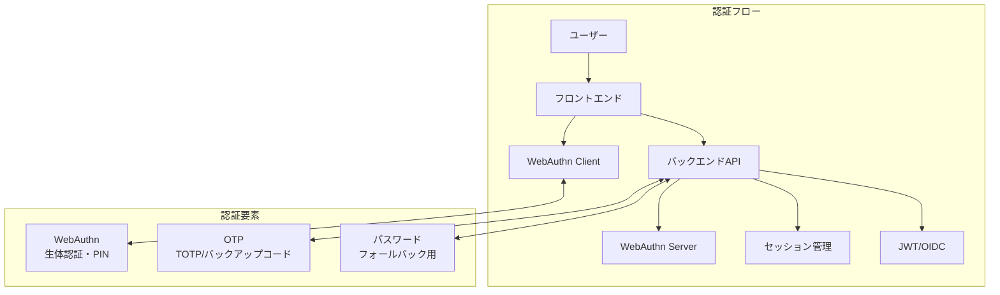

# 認証システム詳細

Oreore.meの認証システムは、WebAuthn（パスワードレス認証）を中心とした最新のセキュリティ技術を採用しています。

## 🔐 認証アーキテクチャ



## 🎯 認証方式

### 1. WebAuthn（Primary）

**特徴**:
- パスワードレス認証
- 生体認証（指紋・顔・虹彩）
- ハードウェアキー対応
- フィッシング耐性

**実装**:
```go
// WebAuthn設定
WebAuthnConfig: &webauthn.Config{
    RPDisplayName: "oreore.me",
    RPID:          "oreore.me",
    RPOrigins:     []string{"https://oreore.me"},
    Timeouts: webauthn.TimeoutsConfig{
        Login:        webauthn.TimeoutConfig{Timeout: time.Second * 60},
        Registration: webauthn.TimeoutConfig{Timeout: time.Second * 60},
    },
}

// 登録開始
func (h *Handler) RegisterBeginWebAuthnHandler(c echo.Context) error {
    options, session, err := h.webAuthn.BeginRegistration(user)
    if err != nil {
        return err
    }

    // セッションを保存
    err = h.storeWebAuthnSession(c, session)
    return c.JSON(200, options)
}

// 登録完了
func (h *Handler) RegisterWebAuthnHandler(c echo.Context) error {
    session := h.getWebAuthnSession(c)
    credential, err := h.webAuthn.FinishRegistration(user, session, c.Request())

    // 認証情報をDBに保存
    return h.saveCredential(user.ID, credential)
}
```

### 2. TOTP（Multi-Factor）

**Google Authenticator等との互換**:
```go
// TOTP設定生成
func GenerateOTPSecret(userEmail string) (*OTPConfig, error) {
    secret := make([]byte, 20)
    rand.Read(secret)

    config := &OTPConfig{
        Secret: base32.StdEncoding.EncodeToString(secret),
        Issuer: "oreore.me",
        AccountName: userEmail,
    }

    return config, nil
}

// TOTP検証
func ValidateOTP(secret, token string) bool {
    return totp.Validate(token, secret)
}

// バックアップコード生成
func GenerateBackupCodes() []string {
    codes := make([]string, 10)
    for i := range codes {
        codes[i] = generateRandomCode(8)
    }
    return codes
}
```

### 3. パスワード（Fallback）

**Argon2ハッシュ化**:
```go
type Password struct {
    Time    uint32  // 処理時間パラメータ
    Memory  uint32  // メモリ使用量（KB）
    Threads uint8   // 並列処理数
    KeyLen  uint32  // ハッシュ長
}

func (p *Password) Hash(password string) (string, error) {
    salt := make([]byte, 16)
    rand.Read(salt)

    hash := argon2.IDKey(
        []byte(password), salt,
        p.Time, p.Memory, p.Threads, p.KeyLen,
    )

    return fmt.Sprintf("$argon2id$v=%d$m=%d,t=%d,p=%d$%s$%s",
        argon2.Version, p.Memory, p.Time, p.Threads,
        base64.RawStdEncoding.EncodeToString(salt),
        base64.RawStdEncoding.EncodeToString(hash),
    ), nil
}
```

## 🔑 セッション管理

### セッション構造

```go
type SessionInfo struct {
    ID        string    `json:"id"`
    UserID    string    `json:"user_id"`
    Period    time.Time `json:"period"`
    CreatedAt time.Time `json:"created_at"`
    IPAddress string    `json:"ip_address"`
    UserAgent string    `json:"user_agent"`
}

// セッション作成
func CreateSession(ctx context.Context, db *sql.DB, userID string) (*SessionInfo, error) {
    session := &models.Session{
        ID:     ulid.Make().String(),
        UserID: userID,
        Period: time.Now().Add(SessionDBPeriod), // 7日間
    }

    err := session.Insert(ctx, db, boil.Infer())
    return session, err
}
```

### Cookie設定

```go
// セッションCookie
SessionCookie: CookieConfig{
    Name:     "oreore-me-session",
    Secure:   true,           // HTTPS必須
    HttpOnly: true,           // XSS対策
    Path:     "/",
    MaxAge:   604800,         // 7日間
    SameSite: http.SameSiteDefaultMode,
}

// リフレッシュトークンCookie
RefreshCookie: CookieConfig{
    Name:     "oreore-me-refresh",
    Secure:   true,
    HttpOnly: true,
    Path:     "/",
    MaxAge:   2592000,        // 30日間
    SameSite: http.SameSiteDefaultMode,
}
```

## 🎫 JWT実装

### トークン種別

| トークン | 用途 | 有効期限 | 格納場所 |
|----------|------|----------|----------|
| Access Token | API認証 | 1時間 | メモリ |
| Refresh Token | トークン更新 | 7日間 | HttpOnly Cookie |
| ID Token | OIDC認証情報 | 1時間 | クライアントアプリ |

### JWT生成・検証

```go
// JWT生成
func GenerateJWT(userID string, exp time.Duration) (string, error) {
    claims := &jwt.StandardClaims{
        Subject:   userID,
        IssuedAt:  time.Now().Unix(),
        ExpiresAt: time.Now().Add(exp).Unix(),
        Issuer:    "oreore.me",
    }

    token := jwt.NewWithClaims(jwt.SigningMethodRS256, claims)
    return token.SignedString(privateKey)
}

// JWT検証
func ValidateJWT(tokenString string) (*jwt.StandardClaims, error) {
    token, err := jwt.ParseWithClaims(tokenString, &jwt.StandardClaims{}, func(token *jwt.Token) (interface{}, error) {
        return publicKey, nil
    })

    if claims, ok := token.Claims.(*jwt.StandardClaims); ok && token.Valid {
        return claims, nil
    }
    return nil, err
}
```

## 🌐 OIDC/OAuth2実装

### Discovery エンドポイント

**`/.well-known/openid-configuration`**:
```json
{
  "issuer": "https://oreore.me",
  "authorization_endpoint": "https://oreore.me/api/v2/oidc/auth",
  "token_endpoint": "https://oreore.me/api/v2/oidc/token",
  "userinfo_endpoint": "https://oreore.me/api/v2/oidc/userinfo",
  "jwks_uri": "https://oreore.me/.well-known/jwks.json",
  "scopes_supported": ["openid", "profile", "email"],
  "response_types_supported": ["code"],
  "grant_types_supported": ["authorization_code", "refresh_token"]
}
```

### Authorization Code Flow

```go
// 認証エンドポイント
func (h *Handler) OIDCAuthHandler(c echo.Context) error {
    // 認証済みかチェック
    user := h.getCurrentUser(c)
    if user == nil {
        // ログイン画面にリダイレクト
        return c.Redirect(302, "/login?redirect="+c.Request().URL.String())
    }

    // 認可コード生成
    code := generateAuthorizationCode()

    // リダイレクトURL構築
    redirectURL := fmt.Sprintf("%s?code=%s&state=%s",
        clientRedirectURI, code, state)

    return c.Redirect(302, redirectURL)
}

// トークンエンドポイント
func (h *Handler) OIDCTokenHandler(c echo.Context) error {
    grantType := c.FormValue("grant_type")

    switch grantType {
    case "authorization_code":
        return h.handleAuthorizationCodeGrant(c)
    case "refresh_token":
        return h.handleRefreshTokenGrant(c)
    default:
        return c.JSON(400, map[string]string{"error": "unsupported_grant_type"})
    }
}
```

### ID Token Claims

```go
type IDTokenClaims struct {
    jwt.StandardClaims

    // OIDC標準クレーム
    Email         string `json:"email"`
    EmailVerified bool   `json:"email_verified"`
    Name          string `json:"name"`
    Picture       string `json:"picture,omitempty"`

    // カスタムクレーム
    Organization  string `json:"org,omitempty"`
    Role          string `json:"role,omitempty"`
}

func GenerateIDToken(user *models.User, clientID string) (string, error) {
    claims := &IDTokenClaims{
        StandardClaims: jwt.StandardClaims{
            Subject:   user.ID,
            Issuer:    "oreore.me",
            Audience:  clientID,
            ExpiresAt: time.Now().Add(IDTokenExpire).Unix(),
            IssuedAt:  time.Now().Unix(),
        },
        Email:         user.Email,
        EmailVerified: true,
        Name:          user.UserName,
        Picture:       user.AvatarURL,
    }

    token := jwt.NewWithClaims(jwt.SigningMethodRS256, claims)
    return token.SignedString(privateKey)
}
```

## 🛡️ セキュリティ対策

### 1. CSRF対策

```go
func CSRFMiddleware(next echo.HandlerFunc) echo.HandlerFunc {
    return func(c echo.Context) error {
        // Sec-Fetch-Siteヘッダーチェック
        fetchSite := c.Request().Header.Get("Sec-Fetch-Site")
        if fetchSite != "" && fetchSite != "same-origin" && fetchSite != "same-site" {
            return c.JSON(403, map[string]string{"error": "CSRF protection"})
        }

        return next(c)
    }
}
```

### 2. レート制限

```go
type RateLimiter struct {
    attempts map[string][]time.Time
    maxAttempts int
    window time.Duration
    mu sync.RWMutex
}

func (r *RateLimiter) Allow(identifier string) bool {
    r.mu.Lock()
    defer r.mu.Unlock()

    now := time.Now()
    cutoff := now.Add(-r.window)

    // 古い試行を削除
    attempts := r.attempts[identifier]
    validAttempts := []time.Time{}
    for _, attempt := range attempts {
        if attempt.After(cutoff) {
            validAttempts = append(validAttempts, attempt)
        }
    }

    // 制限チェック
    if len(validAttempts) >= r.maxAttempts {
        return false
    }

    // 新しい試行を記録
    validAttempts = append(validAttempts, now)
    r.attempts[identifier] = validAttempts

    return true
}
```

### 3. パスワード再設定セキュリティ

```go
func (h *Handler) ForgetPasswordHandler(c echo.Context) error {
    email := c.FormValue("email")

    // レート制限（同一メールアドレス）
    if !h.rateLimiter.Allow("password_reset_" + email) {
        return c.JSON(429, map[string]string{"error": "Too many requests"})
    }

    // ユーザー存在チェック（タイミング攻撃対策のため常に同じ処理時間）
    user := h.findUserByEmailConstantTime(email)

    if user != nil {
        // リセットトークン生成（暗号学的に安全）
        token := generateSecureToken(32)

        // 短期間有効（5分）
        expiry := time.Now().Add(5 * time.Minute)

        // DB保存
        h.savePasswordResetToken(user.ID, token, expiry)

        // メール送信
        h.sendPasswordResetEmail(user.Email, token)
    }

    // 成功レスポンス（ユーザー存在に関わらず）
    return c.JSON(200, map[string]string{"message": "If the email exists, reset link sent"})
}
```

## 🔍 監査とログ

### 認証イベントログ

```go
type AuthEvent struct {
    UserID    string    `json:"user_id"`
    Event     string    `json:"event"`      // login, logout, register, etc.
    Method    string    `json:"method"`     // webauthn, password, otp
    IPAddress string    `json:"ip_address"`
    UserAgent string    `json:"user_agent"`
    Success   bool      `json:"success"`
    Timestamp time.Time `json:"timestamp"`
    Details   string    `json:"details,omitempty"`
}

func LogAuthEvent(userID, event, method string, success bool, details string, c echo.Context) {
    authEvent := AuthEvent{
        UserID:    userID,
        Event:     event,
        Method:    method,
        IPAddress: c.RealIP(),
        UserAgent: c.Request().UserAgent(),
        Success:   success,
        Timestamp: time.Now(),
        Details:   details,
    }

    // 構造化ログ出力
    L.Info("Auth event",
        zap.String("user_id", authEvent.UserID),
        zap.String("event", authEvent.Event),
        zap.String("method", authEvent.Method),
        zap.Bool("success", authEvent.Success),
        zap.String("ip_address", authEvent.IPAddress),
    )

    // 監査DB保存
    saveAuthEvent(authEvent)
}
```

## 📱 クライアント対応

### WebAuthn JS実装

```typescript
// 登録開始
const beginRegistration = async (): Promise<CredentialCreationOptions> => {
    const response = await fetch('/api/v2/register/begin_webauthn', {
        method: 'POST',
        credentials: 'include',
    });
    return await response.json();
};

// WebAuthn登録実行
const registerWebAuthn = async (options: CredentialCreationOptions) => {
    const credential = await navigator.credentials.create({
        publicKey: options.publicKey,
    }) as PublicKeyCredential;

    const response = await fetch('/api/v2/register/webauthn', {
        method: 'POST',
        headers: { 'Content-Type': 'application/json' },
        body: JSON.stringify({ credential }),
        credentials: 'include',
    });

    return await response.json();
};
```

## 📚 関連ドキュメント

- [バックエンドアーキテクチャ](./architecture.md)
- [データベース設計](./database.md)
- [テスト戦略](./testing.md)