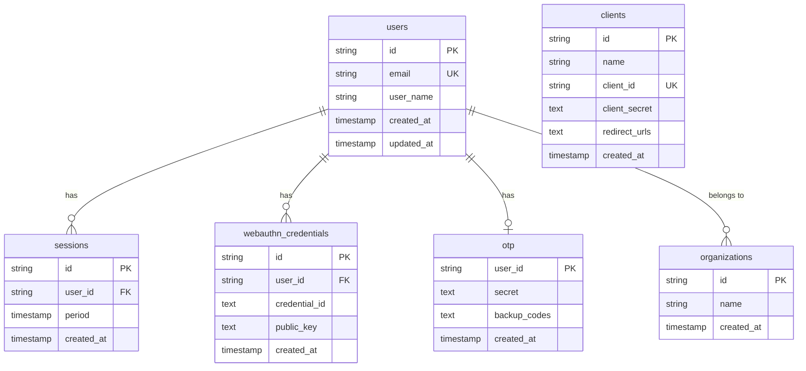

# データベース設計とマイグレーション

Oreore.meは、MySQLを使用したリレーショナルデータベース設計により、堅牢なSSO機能を実現しています。

## 🗃️ データベース構成

### 主要テーブル

| テーブル名 | 説明 | 主要用途 |
|-----------|------|----------|
| `users` | ユーザー基本情報 | 認証・プロフィール管理 |
| `sessions` | セッション管理 | ログイン状態維持 |
| `webauthn_credentials` | WebAuthn認証情報 | パスワードレス認証 |
| `otp` | TOTP設定 | 多要素認証 |
| `clients` | OIDCクライアント | OAuth2アプリケーション |
| `organizations` | 組織管理 | マルチテナント機能 |
| `staff` | 管理者権限 | システム管理 |

### ER図



## 🔧 ORM: SQLBoiler

### 設定ファイル

**`db/sqlboiler.toml`**:
```toml
[mysql]
dbname = "local"
host = "localhost"
port = 3306
user = "docker"
pass = "docker"
sslmode = "false"

[mysql.test]
dbname = "test"
host = "localhost"
port = 3306
user = "docker"
pass = "docker"
```

### モデル自動生成

```bash
# SQLBoilerモデル生成
./scripts/sqlboiler.sh

# 生成されるファイル例
models/
├── users.go                  # User構造体・メソッド
├── sessions.go              # Session構造体・メソッド
├── webauthn_credentials.go  # WebAuthnCredential構造体
└── ...
```

### 使用例

```go
// ユーザー作成
user := &models.User{
    ID:       ulid.Make().String(),
    Email:    "user@example.com",
    UserName: "username",
}
err := user.Insert(ctx, db, boil.Infer())

// ユーザー検索
user, err := models.FindUser(ctx, db, userID)

// 関連データ取得
sessions, err := user.Sessions().All(ctx, db)
credentials, err := user.WebauthnCredentials().All(ctx, db)

// 複雑なクエリ
users, err := models.Users(
    qm.Where("email LIKE ?", "%@example.com"),
    qm.OrderBy("created_at DESC"),
    qm.Limit(10),
).All(ctx, db)
```

## 📝 マイグレーション管理

### ツール

- **mysqldef**: スキーマ差分管理
- **golang-migrate**: マイグレーション実行

### マイグレーションフロー

```bash
# 1. スキーマ編集
vim db/schema.sql

# 2. マイグレーション作成
./scripts/setup_migrate.sh "add_user_avatar_column"

# 3. 生成されたマイグレーション確認
ls db/migrations/
# 20240315120000_add_user_avatar_column.up.sql
# 20240315120000_add_user_avatar_column.down.sql

# 4. マイグレーション実行
./scripts/migrate.sh up

# 5. SQLBoilerモデル再生成
./scripts/sqlboiler.sh
```

### スキーマファイル例

**`db/schema.sql`**:
```sql
CREATE TABLE users (
    id VARCHAR(26) NOT NULL PRIMARY KEY,
    email VARCHAR(255) NOT NULL UNIQUE,
    user_name VARCHAR(50) NOT NULL,
    avatar_url TEXT,
    created_at TIMESTAMP DEFAULT CURRENT_TIMESTAMP,
    updated_at TIMESTAMP DEFAULT CURRENT_TIMESTAMP ON UPDATE CURRENT_TIMESTAMP
);

CREATE TABLE sessions (
    id VARCHAR(26) NOT NULL PRIMARY KEY,
    user_id VARCHAR(26) NOT NULL,
    period TIMESTAMP NOT NULL,
    created_at TIMESTAMP DEFAULT CURRENT_TIMESTAMP,
    FOREIGN KEY (user_id) REFERENCES users(id) ON DELETE CASCADE,
    INDEX idx_user_id (user_id),
    INDEX idx_period (period)
);
```

## 🔐 セキュリティ設計

### 1. データ暗号化

```go
// パスワードハッシュ化（Argon2）
func HashPassword(password string) (string, error) {
    return argon2.IDKey(
        []byte(password),
        salt,
        config.Password.Time,
        config.Password.Memory,
        config.Password.Threads,
        config.Password.KeyLen,
    ), nil
}

// OTPシークレット暗号化保存
func EncryptOTPSecret(secret string) (string, error) {
    // AES-256-GCMによる暗号化
    return encrypt(secret, config.OTPEncryptionKey)
}
```

### 2. データ削除ポリシー

| データ種別 | 保存期間 | 削除タイミング |
|-----------|----------|----------------|
| セッション | 7日間 | 自動削除 |
| WebAuthnチャレンジ | 5分間 | 自動削除 |
| パスワードリセット | 1時間 | 使用後・期限切れ |
| 監査ログ | 1年間 | 定期削除 |

### 3. インデックス戦略

```sql
-- パフォーマンス最適化用インデックス
CREATE INDEX idx_users_email ON users(email);
CREATE INDEX idx_sessions_user_period ON sessions(user_id, period);
CREATE INDEX idx_webauthn_user_id ON webauthn_credentials(user_id);
CREATE INDEX idx_clients_client_id ON clients(client_id);

-- 複合インデックス
CREATE INDEX idx_org_members_org_user ON organization_members(organization_id, user_id);
```

## 🚀 パフォーマンス最適化

### 1. 接続プール設定

```go
// データベース接続設定
func SetupDB(config *mysql.Config) *sql.DB {
    db := sql.Open("mysql", config.FormatDSN())

    // 接続プール設定
    db.SetMaxOpenConns(25)           // 最大接続数
    db.SetMaxIdleConns(5)            // アイドル接続数
    db.SetConnMaxLifetime(time.Hour) // 接続の最大生存時間

    return db
}
```

### 2. クエリ最適化

```go
// N+1問題回避 - Eager Loading
users, err := models.Users(
    qm.Load(models.UserRels.Sessions),
    qm.Load(models.UserRels.WebauthnCredentials),
).All(ctx, db)

// ページネーション
users, err := models.Users(
    qm.OrderBy("created_at DESC"),
    qm.Limit(limit),
    qm.Offset(offset),
).All(ctx, db)

// 条件付きクエリ
query := models.Users()
if emailFilter != "" {
    query = query.Where("email LIKE ?", "%"+emailFilter+"%")
}
if organizationID != "" {
    query = query.Where("organization_id = ?", organizationID)
}
users, err := query.All(ctx, db)
```

## 📊 監視とメトリクス

### 1. スロークエリ監視

```sql
-- MySQL設定
SET GLOBAL slow_query_log = 'ON';
SET GLOBAL long_query_time = 2;
SET GLOBAL log_queries_not_using_indexes = 'ON';
```

### 2. アプリケーションメトリクス

```go
// データベース操作メトリクス
func (d *DatabaseMetrics) RecordQuery(operation string, duration time.Duration, err error) {
    d.QueryDuration.WithLabelValues(operation).Observe(duration.Seconds())
    if err != nil {
        d.QueryErrors.WithLabelValues(operation).Inc()
    }
}

// 使用例
start := time.Now()
user, err := models.FindUser(ctx, db, userID)
metrics.RecordQuery("users.find", time.Since(start), err)
```

## 🔄 バックアップとリストア

### 1. バックアップ戦略

```bash
# 本番環境（Cloud SQL）
# - 自動バックアップ: 毎日 03:00 JST
# - Point-in-timeリカバリ: 7日間
# - リードレプリカ: 可用性向上

# ローカル環境
# 手動バックアップ
./scripts/backup.sh

# データベースエクスポート
mysqldump -u docker -p local > backup_$(date +%Y%m%d_%H%M%S).sql
```

### 2. 災害復旧

```bash
# バックアップからリストア
mysql -u docker -p local < backup_20240315_030000.sql

# Point-in-timeリカバリ（Cloud SQL）
gcloud sql backups restore [BACKUP_ID] --restore-instance=[TARGET_INSTANCE]
```

## 🧪 テストデータ管理

### 1. テスト用ファクトリー

```go
// ユーザーファクトリー
func CreateTestUser(t *testing.T, db *sql.DB, overrides ...func(*models.User)) *models.User {
    user := &models.User{
        ID:       ulid.Make().String(),
        Email:    fmt.Sprintf("test%d@example.com", rand.Int()),
        UserName: "testuser",
    }

    for _, override := range overrides {
        override(user)
    }

    err := user.Insert(context.Background(), db, boil.Infer())
    assert.NoError(t, err)

    return user
}
```

### 2. テストデータクリーンアップ

```go
func CleanupTestDB(t *testing.T, db *sql.DB) {
    tables := []string{
        "sessions", "webauthn_credentials", "otp",
        "organization_members", "clients", "users", "organizations",
    }

    for _, table := range tables {
        _, err := db.Exec(fmt.Sprintf("DELETE FROM %s WHERE 1=1", table))
        assert.NoError(t, err)
    }
}
```

## 📚 関連ドキュメント

- [バックエンドアーキテクチャ](./architecture.md)
- [認証システム](./authentication.md)
- [テスト戦略](./testing.md)