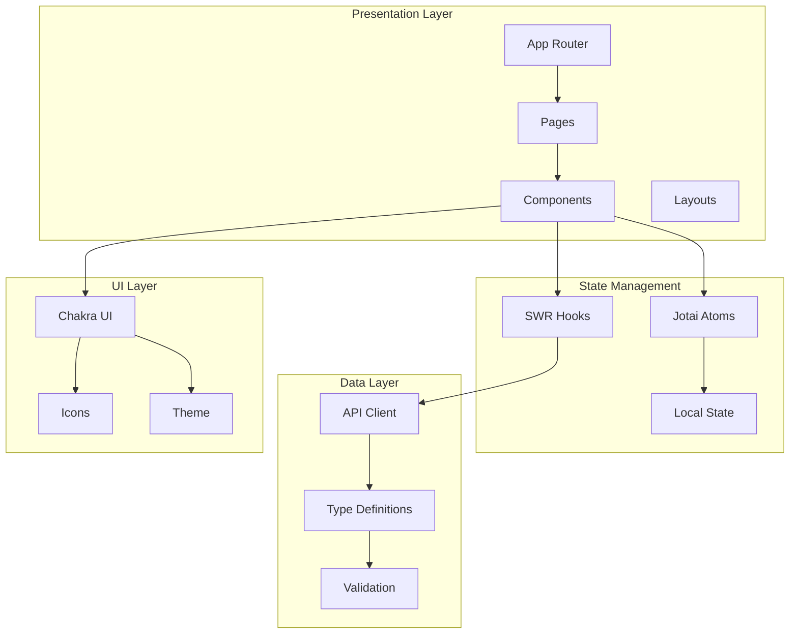

# フロントエンドアーキテクチャ

Oreore.meのフロントエンドは、Next.js 13 App Routerを中心とした最新のReactエコシステムで構築されています。

## 🏗️ アーキテクチャ概要



## 📁 ディレクトリ構造

```
├── app/                          # Next.js 13 App Router
│   ├── layout.tsx               # ルートレイアウト
│   ├── page.tsx                 # ホームページ
│   ├── login/                   # ログイン機能
│   ├── profile/                 # プロフィール管理
│   ├── settings/                # 設定画面
│   └── clients/                 # OIDCクライアント管理
│
├── components/                   # 再利用可能コンポーネント
│   ├── Auth/                    # 認証関連コンポーネント
│   ├── Common/                  # 共通UI部品
│   ├── Client/                  # クライアント管理
│   ├── Login/                   # ログイン画面
│   ├── Profile/                 # プロフィール画面
│   └── Settings/                # 設定画面
│
├── utils/                       # ユーティリティ
│   ├── api.ts                   # API通信ヘルパー
│   ├── config.ts                # 設定管理
│   ├── validate.ts              # バリデーション
│   ├── theme.ts                 # Chakra UIテーマ
│   ├── swr/                     # SWRフック
│   └── types/                   # TypeScript型定義
│
└── stories/                     # Storybook
    ├── Auth/
    ├── Common/
    └── ...
```

## 🎨 技術スタック

### コアライブラリ

```json
{
  "dependencies": {
    "next": "13.4.12",              // Reactフレームワーク
    "@chakra-ui/react": "^2.8.1",   // UIコンポーネント
    "jotai": "^2.5.0",              // 状態管理
    "swr": "^2.2.4",                // データフェッチング
    "react-hook-form": "^7.47.0",   // フォーム管理
    "zod": "^3.22.4",               // バリデーション
    "@github/webauthn-json": "^2.1.1" // WebAuthn
  }
}
```

### 開発ツール

```json
{
  "devDependencies": {
    "typescript": "^5.2.2",         // 型システム
    "gts": "^4.0.1",                // Google TypeScript Style
    "storybook": "^7.4.6",          // コンポーネント開発
    "@faker-js/faker": "^8.1.0"     // テストデータ
  }
}
```

## 🚀 Next.js App Router

### ファイルベースルーティング

```
app/
├── page.tsx                     # / ルート
├── login/page.tsx               # /login
├── profile/page.tsx             # /profile
├── settings/
│   ├── page.tsx                 # /settings
│   └── profile/page.tsx         # /settings/profile
└── clients/
    ├── page.tsx                 # /clients
    └── [id]/page.tsx            # /clients/[id] 動的ルート
```

### レイアウトシステム

```tsx
// app/layout.tsx - ルートレイアウト
export default function RootLayout({
  children,
}: {
  children: React.ReactNode;
}) {
  return (
    <html lang="ja">
      <body>
        <ChakraProvider theme={theme}>
          <JotaiProvider>
            <Header />
            <main>{children}</main>
            <Footer />
          </JotaiProvider>
        </ChakraProvider>
      </body>
    </html>
  );
}

// app/settings/layout.tsx - 設定専用レイアウト
export default function SettingsLayout({
  children,
}: {
  children: React.ReactNode;
}) {
  return (
    <Container maxW="container.lg">
      <Grid templateColumns="250px 1fr" gap={8}>
        <SettingsSidebar />
        <Box>{children}</Box>
      </Grid>
    </Container>
  );
}
```

### サーバーサイド機能

```tsx
// app/profile/page.tsx - Server Component
async function getUserProfile(userId: string) {
  const res = await fetch(`${API_HOST}/api/v2/user/${userId}`, {
    cache: 'no-store', // 常に最新データ
  });
  return await res.json();
}

export default async function ProfilePage() {
  const profile = await getUserProfile('current');

  return (
    <div>
      <h1>{profile.userName}</h1>
      <ProfileForm initialData={profile} />
    </div>
  );
}
```

## 🌊 状態管理: Jotai

### Atomベース設計

```tsx
// utils/atoms/auth.ts
export const currentUserAtom = atom<User | null>(null);
export const isLoggedInAtom = atom((get) => get(currentUserAtom) !== null);
export const loginStateAtom = atom<'loading' | 'authenticated' | 'unauthenticated'>('loading');

// 非同期Atom
export const userProfileAtom = atom(async (get) => {
  const user = get(currentUserAtom);
  if (!user) return null;

  const response = await fetch(`/api/v2/user/${user.id}`);
  return await response.json();
});

// 書き込み可能Atom
export const updateUserNameAtom = atom(
  null,
  async (get, set, newUserName: string) => {
    const user = get(currentUserAtom);
    if (!user) return;

    const response = await fetch(`/api/v2/user/${user.id}`, {
      method: 'PUT',
      body: JSON.stringify({ userName: newUserName }),
    });

    if (response.ok) {
      const updatedUser = await response.json();
      set(currentUserAtom, updatedUser);
    }
  }
);
```

### Provider設定

```tsx
// app/providers.tsx
'use client';

import { Provider as JotaiProvider } from 'jotai';
import { store } from '@/utils/store';

export function Providers({ children }: { children: React.ReactNode }) {
  return (
    <JotaiProvider store={store}>
      {children}
    </JotaiProvider>
  );
}
```

## 📡 データフェッチング: SWR

### API通信レイヤー

```tsx
// utils/api.ts
export const apiClient = {
  get: async <T>(url: string): Promise<T> => {
    const response = await fetch(`${config.apiHost}${url}`, {
      credentials: 'include',
      headers: {
        'Content-Type': 'application/json',
      },
    });

    if (!response.ok) {
      throw new Error(`API Error: ${response.status}`);
    }

    return await response.json();
  },

  post: async <T>(url: string, data?: any): Promise<T> => {
    const response = await fetch(`${config.apiHost}${url}`, {
      method: 'POST',
      credentials: 'include',
      headers: {
        'Content-Type': 'application/json',
      },
      body: data ? JSON.stringify(data) : undefined,
    });

    if (!response.ok) {
      throw new Error(`API Error: ${response.status}`);
    }

    return await response.json();
  },
};
```

### SWRフック

```tsx
// utils/swr/user.ts
export function useCurrentUser() {
  const { data, error, mutate } = useSWR<User>('/api/v2/user/me', apiClient.get);

  return {
    user: data,
    isLoading: !error && !data,
    isError: error,
    mutate,
  };
}

export function useUserList(organizationId?: string) {
  const url = organizationId
    ? `/api/v2/users?org=${organizationId}`
    : '/api/v2/users';

  const { data, error } = useSWR<User[]>(url, apiClient.get);

  return {
    users: data || [],
    isLoading: !error && !data,
    isError: error,
  };
}

// 条件付きフェッチ
export function useOIDCClients(enabled: boolean) {
  const { data, error } = useSWR(
    enabled ? '/api/v2/clients' : null,
    apiClient.get
  );

  return {
    clients: data || [],
    isLoading: enabled && !error && !data,
    isError: error,
  };
}
```

## 🎭 UIコンポーネント: Chakra UI

### テーマカスタマイズ

```tsx
// utils/theme.ts
import { extendTheme } from '@chakra-ui/react';

export const theme = extendTheme({
  fonts: {
    heading: 'Noto Sans JP, sans-serif',
    body: 'Noto Sans JP, sans-serif',
  },
  colors: {
    brand: {
      50: '#e6f7f8',
      100: '#b3e9ec',
      500: '#2bc4cf',  // メインカラー
      600: '#22a3ad',
      900: '#1a7f87',
    },
  },
  components: {
    Button: {
      defaultProps: {
        colorScheme: 'brand',
      },
    },
    FormLabel: {
      baseStyle: {
        fontSize: 'sm',
        fontWeight: 'semibold',
      },
    },
  },
});
```

### 共通コンポーネント

```tsx
// components/Common/LoadingSpinner.tsx
interface LoadingSpinnerProps {
  size?: 'sm' | 'md' | 'lg';
  text?: string;
}

export const LoadingSpinner: React.FC<LoadingSpinnerProps> = ({
  size = 'md',
  text = '読み込み中...',
}) => {
  return (
    <Center py={8}>
      <VStack spacing={4}>
        <Spinner size={size} color="brand.500" />
        <Text color="gray.600">{text}</Text>
      </VStack>
    </Center>
  );
};

// components/Common/ErrorBoundary.tsx
export class ErrorBoundary extends React.Component<
  React.PropsWithChildren<{}>,
  { hasError: boolean }
> {
  constructor(props: React.PropsWithChildren<{}>) {
    super(props);
    this.state = { hasError: false };
  }

  static getDerivedStateFromError(error: Error) {
    return { hasError: true };
  }

  render() {
    if (this.state.hasError) {
      return (
        <Alert status="error">
          <AlertIcon />
          <Box>
            <AlertTitle>エラーが発生しました</AlertTitle>
            <AlertDescription>
              ページをリロードしてお試しください。
            </AlertDescription>
          </Box>
        </Alert>
      );
    }

    return this.props.children;
  }
}
```

## 📝 フォーム管理

### React Hook Form + Zod

```tsx
// components/Profile/ProfileForm.tsx
const profileSchema = z.object({
  userName: z.string().min(1, 'ユーザー名は必須です').max(50, 'ユーザー名は50文字以内です'),
  email: z.string().email('有効なメールアドレスを入力してください'),
  bio: z.string().max(200, '自己紹介は200文字以内です').optional(),
});

type ProfileFormData = z.infer<typeof profileSchema>;

interface ProfileFormProps {
  initialData?: Partial<ProfileFormData>;
  onSubmit: (data: ProfileFormData) => Promise<void>;
}

export const ProfileForm: React.FC<ProfileFormProps> = ({
  initialData,
  onSubmit,
}) => {
  const {
    register,
    handleSubmit,
    formState: { errors, isSubmitting },
  } = useForm<ProfileFormData>({
    resolver: zodResolver(profileSchema),
    defaultValues: initialData,
  });

  return (
    <Box as="form" onSubmit={handleSubmit(onSubmit)}>
      <VStack spacing={6} align="stretch">
        <FormControl isInvalid={!!errors.userName}>
          <FormLabel>ユーザー名</FormLabel>
          <Input {...register('userName')} />
          <FormErrorMessage>
            {errors.userName?.message}
          </FormErrorMessage>
        </FormControl>

        <FormControl isInvalid={!!errors.email}>
          <FormLabel>メールアドレス</FormLabel>
          <Input type="email" {...register('email')} />
          <FormErrorMessage>
            {errors.email?.message}
          </FormErrorMessage>
        </FormControl>

        <Button
          type="submit"
          isLoading={isSubmitting}
          loadingText="保存中..."
        >
          保存
        </Button>
      </VStack>
    </Box>
  );
};
```

## 🔐 認証統合

### WebAuthn実装

```tsx
// components/Auth/WebAuthnButton.tsx
import { create, get } from '@github/webauthn-json';

export const WebAuthnButton: React.FC = () => {
  const [isLoading, setIsLoading] = useState(false);

  const handleRegister = async () => {
    setIsLoading(true);

    try {
      // 1. サーバーから登録オプション取得
      const optionsResponse = await apiClient.post<CredentialCreationOptions>(
        '/api/v2/register/begin_webauthn'
      );

      // 2. WebAuthn認証器で認証情報作成
      const credential = await create(optionsResponse);

      // 3. サーバーに認証情報送信
      await apiClient.post('/api/v2/register/webauthn', { credential });

      toast({
        title: 'パスキーが登録されました',
        status: 'success',
      });
    } catch (error) {
      toast({
        title: '登録に失敗しました',
        description: error.message,
        status: 'error',
      });
    } finally {
      setIsLoading(false);
    }
  };

  return (
    <Button
      leftIcon={<Icon as={FiShield} />}
      onClick={handleRegister}
      isLoading={isLoading}
      loadingText="登録中..."
    >
      パスキーで登録
    </Button>
  );
};
```

## 📱 レスポンシブ対応

### ブレークポイント活用

```tsx
// components/Layout/Header.tsx
export const Header: React.FC = () => {
  const { isOpen, onOpen, onClose } = useDisclosure();

  return (
    <Box bg="white" px={4} shadow="sm">
      <Flex h={16} alignItems="center" justifyContent="space-between">
        <Logo />

        {/* デスクトップメニュー */}
        <HStack as="nav" spacing={4} display={{ base: 'none', md: 'flex' }}>
          <NavLinks />
        </HStack>

        {/* モバイルハンバーガーメニュー */}
        <IconButton
          display={{ base: 'block', md: 'none' }}
          onClick={onOpen}
          variant="outline"
          aria-label="メニューを開く"
          icon={<HamburgerIcon />}
        />
      </Flex>

      {/* モバイルドロワー */}
      <Drawer isOpen={isOpen} placement="right" onClose={onClose}>
        <DrawerOverlay />
        <DrawerContent>
          <DrawerHeader>メニュー</DrawerHeader>
          <DrawerBody>
            <VStack align="stretch" spacing={2}>
              <NavLinks />
            </VStack>
          </DrawerBody>
        </DrawerContent>
      </Drawer>
    </Box>
  );
};
```

## 🧪 テストとStorybook

### コンポーネントテスト

```tsx
// components/Login/LoginForm.stories.tsx
export default {
  title: 'Auth/LoginForm',
  component: LoginForm,
} as Meta<typeof LoginForm>;

export const Default: Story = {};

export const WithError: Story = {
  parameters: {
    msw: {
      handlers: [
        rest.post('/api/v2/login/password', (req, res, ctx) => {
          return res(ctx.status(401), ctx.json({ error: 'Invalid credentials' }));
        }),
      ],
    },
  },
};

export const Loading: Story = {
  parameters: {
    msw: {
      handlers: [
        rest.post('/api/v2/login/password', (req, res, ctx) => {
          return res(ctx.delay('infinite'));
        }),
      ],
    },
  },
};
```

## 📚 関連ドキュメント

- [コンポーネント設計](./components.md)
- [状態管理詳細](./state-management.md)
- [テスト戦略](./testing.md)