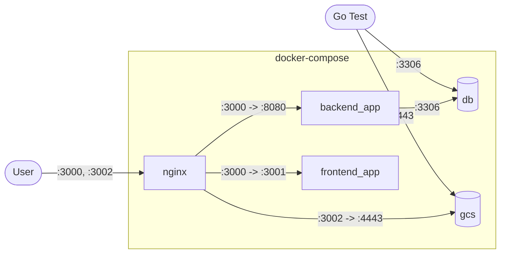

# 開発環境構築

このドキュメントでは、Oreore.meの開発環境を構築する手順を説明します。

## 前提条件

以下のツールがインストールされている必要があります：

- **Docker** (v20.10+)
- **Docker Compose** (v2.20.0+)
- **Node.js** (v18+)
- **pnpm** (v8+)
- **Go** (v1.22+) - バックエンドの個別テスト用
- **Git**

## クイックスタート

### 1. リポジトリのクローン

```bash
git clone https://github.com/cateiru/cateiru-sso.git
cd cateiru-sso
```

### 2. Docker Composeで全体を起動

```bash
docker compose up
```

これで以下のサービスが利用可能になります：

- **フロントエンド**: http://localhost:3000
- **管理者向け**: http://localhost:3002
- **バックエンドAPI**: http://localhost:3000/api (nginxでプロキシ)
- **MySQL**: localhost:3306
- **Object Storage**: localhost:4443

### 3. 管理者アクセス

ローカル環境では`admin@local.test`ユーザーが事前に作成されています。

1. http://localhost:3000/forget_password でパスワード再設定
2. コンソールログから再設定URLを取得
3. 新しいパスワードを設定

```log
DEBUG   src/handler.go:160      send mail       {"email_address": "admin@local.test", "data": {"URL":"http://localhost:3000/forget_password/reregister?email=admin%40local.test&token=8K7R0stblqJLp8AyIOh3yzFYYSQl3RA",...}}
```

## 個別サービス起動

### バックエンドのみ起動

```bash
# データベースだけ起動
./scripts/docker-compose-db.sh up -d

# Goアプリケーションを直接実行
go mod download
MODE=local go run .
```

### フロントエンドのみ起動

```bash
# 依存関係インストール
pnpm install

# 開発サーバー起動
pnpm dev

# ブラウザで http://localhost:3001 を開く
```

## コンテナ構成

Docker Compose環境では以下のコンテナが起動されます：

| サービス | 説明 | ポート |
|---------|------|--------|
| `backend_app` | Goバックエンドサーバー | 8080 |
| `frontend_app` | Next.jsフロントエンド | 3001 |
| `nginx` | リバースプロキシ | 3000, 3002 |
| `db` | MySQLデータベース | 3306 |
| `gcs` | オブジェクトストレージ（エミュレータ） | 4443 |

### ネットワーク構成



## 開発用コマンド

### バックエンド

```bash
# テスト実行
./scripts/docker-compose-db.sh up -d  # DBを先に起動
./scripts/test.sh                      # Goテスト実行

# データベース接続
./scripts/sql.sh

# マイグレーション
./scripts/setup_migrate.sh [migration_name]  # マイグレーション作成
./scripts/migrate.sh up                       # マイグレーション実行
./scripts/sqlboiler.sh                        # SQLBoilerモデル再生成
```

### フロントエンド

```bash
# 依存関係管理
pnpm install
pnpm update

# 開発・ビルド
pnpm dev           # 開発サーバー起動
pnpm build         # 本番ビルド
pnpm start         # 本番サーバー起動

# コード品質
pnpm lint          # ESLint + TypeScript チェック
pnpm fix           # 自動修正

# Storybook
pnpm storybook     # Storybook起動 (http://localhost:6006)
```

## トラブルシューティング

### よくある問題

#### 1. Docker Compose起動エラー

```bash
# 古いコンテナ・ネットワークをクリーンアップ
docker compose down
docker system prune

# 再起動
docker compose up --build
```

#### 2. ポート競合

既に使用中のポートがある場合は、`docker-compose.yaml`で別のポートに変更してください。

#### 3. データベース接続エラー

```bash
# データベースコンテナの状態確認
docker compose logs db

# データベース再作成
docker compose down -v
docker compose up db
```

#### 4. Node.js依存関係エラー

```bash
# node_modulesクリーンアップ
rm -rf node_modules
rm pnpm-lock.yaml
pnpm install
```

### ログ確認

```bash
# 全サービスのログ
docker compose logs -f

# 特定サービスのログ
docker compose logs -f backend_app
docker compose logs -f frontend_app
```

### データベースリセット

```bash
# データベースを完全リセット
docker compose down -v
docker compose up -d db
./scripts/migrate.sh up
```

## 開発フロー

### 推奨開発手順

1. **環境起動**
   ```bash
   docker compose up -d
   ```

2. **機能開発**
   - バックエンド: `src/`ディレクトリで開発
   - フロントエンド: `components/`, `app/`ディレクトリで開発

3. **テスト**
   ```bash
   # バックエンドテスト
   ./scripts/test.sh

   # フロントエンドlint
   pnpm lint
   ```

4. **Storybook確認**（フロントエンド変更時）
   ```bash
   pnpm storybook
   ```

5. **コミット前チェック**
   ```bash
   pnpm lint
   ./scripts/test.sh
   ```

### ホットリロード

- **バックエンド**: Air設定により`.go`ファイル変更で自動リロード
- **フロントエンド**: Next.js標準のホットリロード

## IDE設定

### VS Code推奨拡張機能

```json
{
  "recommendations": [
    "golang.go",
    "bradlc.vscode-tailwindcss",
    "esbenp.prettier-vscode",
    "ms-vscode.vscode-typescript-next"
  ]
}
```

## 次のステップ

- [環境変数設定](./environment-variables.md)
- [Docker詳細設定](./docker-setup.md)
- [バックエンドアーキテクチャ](../backend/architecture.md)