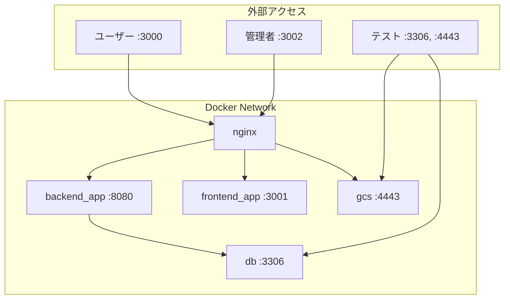

# Docker構成詳細

Oreore.meのDocker環境は、開発の効率性とポータビリティを重視して設計されています。

## 📁 構成ファイル

```
docker-compose.yaml                 # メインComposeファイル
docker/
├── docker-compose.db.yaml          # データベース専用
├── docker-compose.local.yaml       # ローカル開発環境
├── docker-compose.db-healthcheck.yaml  # ヘルスチェック設定
├── Dockerfile.go-app               # Goアプリケーション用
└── Dockerfile.next-app             # Next.jsアプリケーション用
```

## 🐳 サービス構成

### 1. backend_app (Goバックエンド)

```yaml
services:
  backend:
    container_name: backend_app
    build:
      context: ..
      dockerfile_inline: |
        FROM golang:1.22.0-alpine
        # Air (ホットリロード) インストール
        RUN go install github.com/cosmtrek/air@v1.52.3
        # JWT鍵ペア生成
        RUN ssh-keygen -t rsa -f /jwt/jwt -N "" -m pem
```

**特徴:**
- **ホットリロード**: Airを使用してGoファイル変更時の自動再起動
- **JWT鍵生成**: 起動時に自動でJWT用の秘密鍵・公開鍵ペアを生成
- **ヘルスチェック**: `/`エンドポイントでの生存確認
- **ポート**: 8080 (内部) → 8080 (外部)

### 2. frontend_app (Next.js)

```yaml
services:
  frontend:
    container_name: frontend_app
    build:
      dockerfile_inline: |
        FROM node:18-alpine
        RUN npm install -g pnpm
```

**特徴:**
- **pnpm使用**: 高速なパッケージマネージャー
- **開発モード**: `pnpm dev`でホットリロード対応
- **ポート**: 3001 (内部) → 3001 (外部)

### 3. nginx (リバースプロキシ)

```yaml
services:
  nginx:
    container_name: nginx
    ports:
      - "3000:80"   # ユーザー向け
      - "3002:8080" # 管理者向け
```

**機能:**
- APIとフロントエンドを同一ポートで提供
- 静的ファイル配信の最適化
- CORS設定の一元管理

### 4. db (MySQL)

```yaml
services:
  db:
    build:
      dockerfile_inline: |
        FROM mysql:8.0-debian
        # マイグレーションツールインストール
        RUN curl -s https://packagecloud.io/install/repositories/golang-migrate/migrate/script.deb.sh | bash
        RUN apt install -y migrate
        # SQLDefインストール
        RUN curl -OL https://github.com/k0kubun/sqldef/releases/download/v0.17.11/mysqldef_linux_amd64.tar.gz
```

**特徴:**
- **マイグレーションツール**: golang-migrate内蔵
- **スキーマ管理**: mysqldef内蔵
- **文字セット**: utf8mb4 (絵文字対応)
- **タイムゾーン**: Asia/Tokyo

### 5. gcs (オブジェクトストレージ)

```yaml
services:
  gcs:
    image: fsouza/fake-gcs-server
    command: ["-scheme", "http"]
    ports:
      - "4443:4443"
```

**機能:**
- Cloud Storageのエミュレーター
- ファイルアップロード・ダウンロードテスト
- 本番環境との互換性確保

## 🔗 ネットワーク構成



### プロキシルーティング

| パス | プロキシ先 | 説明 |
|------|------------|------|
| `/api/*` | `backend_app:8080` | API リクエスト |
| `/.well-known/*` | `backend_app:8080` | OIDC メタデータ |
| `/fedcm/*` | `backend_app:8080` | FedCM API |
| `/*` | `frontend_app:3001` | 静的ファイル・SSR |

### 管理者ポート (3002)

| パス | プロキシ先 | 説明 |
|------|------------|------|
| `/oreore-me/*` | `gcs:4443` | ストレージアクセス |

## 📋 起動パターン

### 1. フル環境起動

```bash
# 全サービス起動
docker compose up

# バックグラウンド起動
docker compose up -d

# 特定サービスのみ
docker compose up backend frontend
```

### 2. データベースのみ起動

```bash
# テスト用にDBだけ起動
./scripts/docker-compose-db.sh up -d

# 等価なコマンド
docker compose -f docker-compose.yaml -f docker/docker-compose.db.yaml up -d
```

### 3. 分離起動パターン

```bash
# データベース起動
docker compose up -d db

# バックエンドをローカルで起動
MODE=local go run .

# フロントエンドをローカルで起動
pnpm dev
```

## 🔧 カスタマイズ

### ポート変更

```yaml
# docker-compose.override.yaml
services:
  frontend:
    ports:
      - "3010:3001"  # ポート変更

  nginx:
    ports:
      - "3100:80"    # メインポート変更
```

### 環境変数追加

```yaml
services:
  backend:
    environment:
      - DEBUG=true
      - LOG_LEVEL=debug
```

### ボリュームマウント

```yaml
services:
  db:
    volumes:
      - db_data:/var/lib/mysql        # データ永続化
      - ./db/init:/docker-entrypoint-initdb.d  # 初期化SQL

volumes:
  db_data:
```

## 🛠️ 開発用コマンド

### コンテナ管理

```bash
# 状態確認
docker compose ps

# ログ確認
docker compose logs -f backend
docker compose logs -f --tail=50 db

# コンテナに入る
docker compose exec backend sh
docker compose exec db mysql -u docker -p

# 再ビルド
docker compose up --build

# データボリューム削除
docker compose down -v
```

### デバッグ

```bash
# ヘルスチェック確認
docker compose ps
# 健全性: healthy/unhealthy/starting

# コンテナ詳細確認
docker inspect backend_app

# ネットワーク確認
docker network ls
docker network inspect cateiru-sso_default
```

## 🔍 トラブルシューティング

### よくある問題と対策

#### 1. ポート競合

```bash
# エラー例
Error: bind: address already in use

# 対策: 使用中ポート確認
lsof -i :3000
netstat -tulpn | grep :3000

# ポート変更またはプロセス終了
```

#### 2. ビルドエラー

```bash
# キャッシュクリア
docker compose build --no-cache

# Dockerシステム全体クリーンアップ
docker system prune -a
```

#### 3. データベース初期化エラー

```bash
# ボリューム削除して再作成
docker compose down -v
docker volume prune
docker compose up db
```

#### 4. 権限エラー (Linux)

```bash
# Dockerグループに追加
sudo usermod -aG docker $USER
newgrp docker

# または sudo使用
sudo docker compose up
```

## 📈 パフォーマンス最適化

### 1. イメージ最適化

```dockerfile
# マルチステージビルド
FROM node:18-alpine AS builder
WORKDIR /app
COPY package*.json ./
RUN npm ci --only=production

FROM node:18-alpine AS runner
COPY --from=builder /app/node_modules ./node_modules
```

### 2. ボリュームマウント最適化

```yaml
services:
  backend:
    volumes:
      # キャッシュを専用ボリュームに
      - go_cache:/root/.cache/go-build
      - go_mod_cache:/go/pkg/mod
      - ..:/app

volumes:
  go_cache:
  go_mod_cache:
```

### 3. 開発用設定

```yaml
# docker-compose.dev.yaml
services:
  backend:
    environment:
      - GOCACHE=/root/.cache/go-build
      - GOMODCACHE=/go/pkg/mod

  frontend:
    environment:
      - NEXT_TELEMETRY_DISABLED=1
      - WATCHPACK_POLLING=true  # WSL用
```

## 🚀 本番環境との違い

| 項目 | ローカル | 本番 |
|------|----------|------|
| コンテナ | Docker Compose | Cloud Run |
| データベース | MySQL in Docker | Cloud SQL |
| ストレージ | fake-gcs-server | Cloud Storage |
| 秘密鍵 | コンテナ内生成 | Secret Manager |
| HTTPS | HTTP | HTTPS (自動証明書) |
| CDN | なし | Fastly |

## 📚 関連ドキュメント

- [開発環境構築](./development-setup.md)
- [環境変数設定](./environment-variables.md)
- [バックエンドアーキテクチャ](../backend/architecture.md)